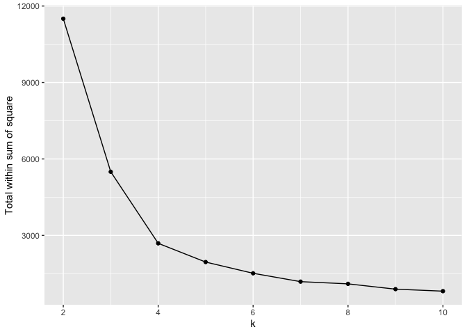

Cross-Stitch Pattern
================
Jin Seo Jo

We will use the packages called `tidyverse`, `tidymodels`, `imager`,
`dmc`(a package for choosing thread colour), `scales`, `cowplot`, and
`sp`(which is used in the `change_resolution` function.)

``` r
library(imager)
library(tidyverse)
library(tidymodels)
library(sp)
library(scales)
library(cowplot)
#devtools::install_github("sharlagelfand/dmc")
library(dmc)
```

## Load functions

We will use four different functions: `process_image`, `scree_plot`,
`colour_strips`, and `make_pattern`. To use these functions, I will call
“functions.R” file. The “functions.R” file contains all of the R
functions I wrote to produce a cross-stitch pattern.

``` r
source("functions.R")
```

## Load image

I will use an image called “Ada with Sunglasses” by Alex Katz. First, I
will load and plot the image.

``` r
im <- imager::load.image("ada_with_sunglasses.jpg")
plot(im)
```

<!-- -->

## Get cluster information

To perform k-means clustering, we first need to collect all information
derived from the k-menas clustering. The function called `process_image`
will produce all of the information that we needed. Hence, we will first
need to use the `process_image` function.

The `process_image` function use two arguments. The one is the
`image_file_name`. The `image_file_name` is a PNG or JPEG image, so we
will use `im`. The other one is the `k_list`. `k_list` indicates the
number of centres in the clustering. It can be a sigle value or list.
Before we perform `process_image` function, we need to define `k_list`.
In this case, I will set `k_list = c(2:10)`. In other words, I will use
a list where the number of centres in the clustering starts from 2 and
ends at 10.

The output of the `process_image` function is a list which contains five
elements. The function will contain all of the information derived from
the k-means clustering on the art of “Ada with Sunglasses”. That is, it
contains information about original output of the kclust calls, the
tidied clusters with their associated RGB values and their nearest DMC
thread colour information, and an augmented data with the clusters.

I will assign the function output to `cluster_info` for convenience.

``` r
cluster_info <- process_image(im, c(2:10))
```

The `cluster_info` will give a list with five elements.

Now, we will explore some useful outputs from the `cluster_info`
function.

``` r
head(cluster_info[[1]])
```

    ## # A tibble: 6 x 8
    ##        R     G     B  size withinss cluster col     colour              
    ##    <dbl> <dbl> <dbl> <int>    <dbl> <fct>   <chr>   <list>              
    ## 1 0.504  0.467 0.432  2642     91.9 1       #81776E <dmc_df[,6] [1 × 6]>
    ## 2 0.522  0.801 0.789 26716    141.  2       #85CCC9 <dmc_df[,6] [1 × 6]>
    ## 3 0.0327 0.202 0.159 25065     25.1 3       #083428 <dmc_df[,6] [1 × 6]>
    ## 4 0.972  0.724 0.642 38460     22.0 4       #F8B9A4 <dmc_df[,6] [1 × 6]>
    ## 5 0.113  0.110 0.111 81401    117.  5       #1D1C1C <dmc_df[,6] [1 × 6]>
    ## 6 0.912  0.553 0.385 49324    160.  6       #E98D62 <dmc_df[,6] [1 × 6]>

``` r
cluster_info[[1]]$colour[[1]]
```

    ## # A tibble: 1 x 6
    ##   dmc   name               hex       red green  blue
    ##   <chr> <chr>              <chr>   <dbl> <dbl> <dbl>
    ## 1 646   Beaver Gray - Dark #877D73   135   125   115


The first element from the `cluster_info` indicates the tidied clusters.
The result shows `col` which indicates RGB(Red, Green, Blue) colours,
and `colour` indicates the nearest DMC thread colour infomation which is
based on the `col` values. Note that each value in `colour` contains 6
variables: `dmc`, `name`, `hex`, `red`, `green`, `blue`. Later on, we
will use `dmc` and `name` to make a legend of cross-stitch pattern.

``` r
head(cluster_info[[2]])
```

    ## # A tibble: 6 x 6
    ##       x     y     R     G     B cluster
    ##   <int> <int> <dbl> <dbl> <dbl> <fct>  
    ## 1     1     1 0.529 0.733 0.776 2      
    ## 2     2     1 0.533 0.753 0.757 2      
    ## 3     3     1 0.537 0.761 0.737 2      
    ## 4     4     1 0.525 0.757 0.733 2      
    ## 5     5     1 0.522 0.753 0.745 2      
    ## 6     6     1 0.533 0.749 0.761 2

The second element from the `cluster_info` shows the output of the
`augment` function. We augment the initial data with the clusters. The
`augment` function allows us to add the point classifications to the
original data set. We will use this output while we make the
cross-stitch pattern. Especially, we will use this when we produce a
lower resolution image. Note that the helper function called
`change_resolution` will produce a lower resolution image, and this
helper function will be used in `make_pattern` function.

``` r
summary(cluster_info[[3]])
```

    ##              Length Class  Mode   
    ## cluster      273920 -none- numeric
    ## centers          30 -none- numeric
    ## totss             1 -none- numeric
    ## withinss         10 -none- numeric
    ## tot.withinss      1 -none- numeric
    ## betweenss         1 -none- numeric
    ## size             10 -none- numeric
    ## iter              1 -none- numeric
    ## ifault            1 -none- numeric

The third element from the `cluster_info` will give the original output
of the `kclust` calls. We will use “withinss” component to produce a
scree plot. That is, the y-axis scree plot will indicate the sum of
“withinss” values for each `k` in `k_list`.

## Choose k for k-means clustering

Based on the information from the `cluster_info`, we can produce and
plot a scree plot to choose an appropriate value of k. To produce the
scree plot, we will use a function called `scree_plot`.

The `scree_plot` function require one argument called `val`. This `val`
is the output of `process_image` function. Based on the information in
`val`, the `scree_plot` will make a plot where x-axis indicates the
number of clusters, and y-axis indicates the total within sum of square.
From the `val`, we can calculate the total within sum of square. The
original output of the `kclust` calls give the numbers that we required
for the total within sum of square. This function allow us to determine
the best k value (i.e. cluster number).  
In this case, `val` indicates `cluster_info`. Then the our scree plot
looks like this.

``` r
scree_plot(cluster_info)
```

<!-- -->

The y-axis indicates the amount of information retained after k-means
clustering. Based on the plot, we can determine the best number k by
using an elbow method. That is, we need to select the best k value at
the “elbow”. The “elbow” is the point after the disorting start
decreasing in a linear fashion. In this case, we can find that `k=4`
would be the best number of clusters.

## Make colour strips

We found the optimal number of clusters (i.e. k = 4). Now, we can also
extract the best k numbers of colours from the dataset. To do this, we
will use a function called `colour_strips`.

The `colour_strips` function produces colour strips with DMC colour
closet to the cluster centre colour. We know that the arguement `val`
indicates the output of the `process_image` function. From the
`process_image` function, we set `k_list` which is either a single value
or list. If `k_list` is a single value, say “p”, then `colour_strips`
will produce “p” colours in a strip. However, if `k_list` is a list,
then `colour_strips` will generate a bunch of different colour strips
depedning on the values in `k_list`.

In our case, we set `k_list = c(2:10)`. Therefore, it will produce 9
different colour strips. Note that the colours in the strips would be in
hex code of the closest DMC colour for each centre. The labels in the
strips are based on the RGB
colours.

``` r
colour_strips(cluster_info)
```


Now consider the `scree_plot` function. From the `scree_plot` function,
we found the optimal k value for `im` which is 4. Then colours in the
colour strips of `k = 4` would be the optimal colours since we found
that `k = 4` is the best number of clusters for `im`.

## Make cross-stitch pattern

We found the best number of cluters and produce a bunch of differnt
colour strips. Now, based on this information, we can make a
cross-stitch pttern for the art of “Ada with Sunglasses”. To produce the
cross-stitch pattern, we will use the function called `make_pattern`.

The `make_pattern` function use `change_resolution` helper fucntion
which produce a lower resolution image. The `make_pattern` requires five
arguments. The first arugment indicates the output of `process_image`
function. The second argument indicates the chosen cluster size from the
scree plot. The third argument indicates the (approximate) total number
of possible stitches in the horizontal direction, and the default value
is 50. The fourth argument prints the pattern in black or white (TRUE)
or colour (FALSE). The default value is FALSE. The last argument
indicates the colour of the background, which should not be stitched in
the pattern. The default value is FALSE.

Now let’s produce some cross-stitch patterns of “Ada with Sunglasses”,
and plot the optimal or best cross-stitch pattern which is based on
k-means clustering method.

### Cross-stitch pattern with colour pattern

``` r
make_pattern(cluster_info, 10, 25)
```

<!-- -->

Note that the clustering that was used to make this pattern had 10
clusters, but after reducting the resolution in `make_pattern` function,
one of these clusters did not appear in the final picture. It only
contains 9 clusters.

### Cross-stitch pattern with black and white pattern

``` r
make_pattern(cluster_info, 10, 25, black_white = TRUE)
```

<!-- -->

### Cross-stitch pattern with colour of the background

``` r
# '#1E1108' indicates 'Black Brown(3371)' colour
make_pattern(cluster_info, 10, 25, background_colour = "#1E1108")
```

<!-- -->

Note that the legend does not contain the ’Black Brown(3371)\` colour.
It is used for the colour of the background.

### Cross-stitch pattern with the optimal cluster number (i.e. k = 4)

Since we found the best cluster number from the scree plot, let’s make a
cross-stitch pattern with the optimal value of k. Instead of using
`k_list = c(2:10)`, let’s use the the optimal number of the clusters.
That is, we will set `k_list
= 4`.

##### Assign new variable called `cluster_info_new` where `k_list = 4`

``` r
cluster_info_new <- process_image(im, 4)
```

##### Now let’s find the corresponding colour strips by using the function called `colour_strips`

``` r
colour_strips(cluster_info_new)
```

<!-- -->

The colours in the colour strips would be the best four different
colours, and these colours will be used for legend in the cross-stitch
pattern.

##### Finally, make a cross-stitch pattern

``` r
make_pattern(cluster_info_new, 4)
```

<!-- -->

This is the optimal cross-stitch pattern of “Ada with Sunglasses”. We
used four different types of symbols to differentiate colours. Grid
lines are also indicated to help read the pattern. The legend contains
both name of the colour and the colour number. You can see the acutal or
real colour from the output of the `colour_strips` function.
